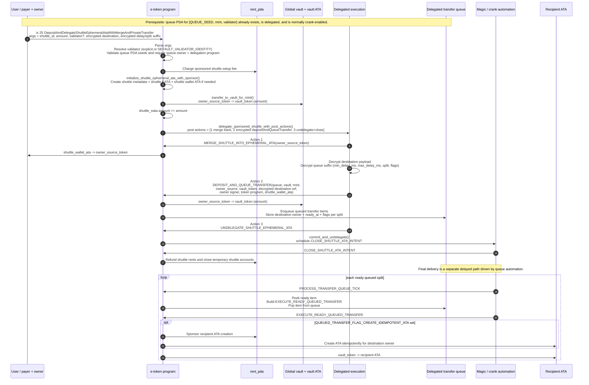
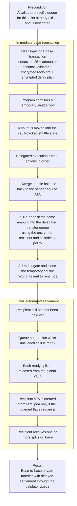

## Private Payments

`process_deposit_and_delegate_shuttle_ephemeral_ata_with_merge_and_private_transfer`
(instruction `25`) does not directly deliver funds to the recipient.
It stages a temporary sponsored shuttle flow, injects an encrypted
`DEPOSIT_AND_QUEUE_TRANSFER` as a post-delegation action, and only later settles
to the recipient through the validator-scoped transfer queue.

Important preconditions:
- The transfer queue PDA for `[QUEUE_SEED, mint, validator]` must already exist.
- That queue must already be delegated. Instruction `25` only validates and uses it.
- Automatic delivery happens later through queue-crank automation, not inside the
  outer transaction itself.

### Technical Sequence

### User View

### What This Means

- The shuttle is temporary infrastructure, not the final recipient path.
- The destination is not paid in the outer instruction `25`.
- Privacy comes from encrypting the destination and queue policy inside the
  delegated action payload.
- Final delivery happens later from the global vault through the queue, possibly
  split across multiple releases.
